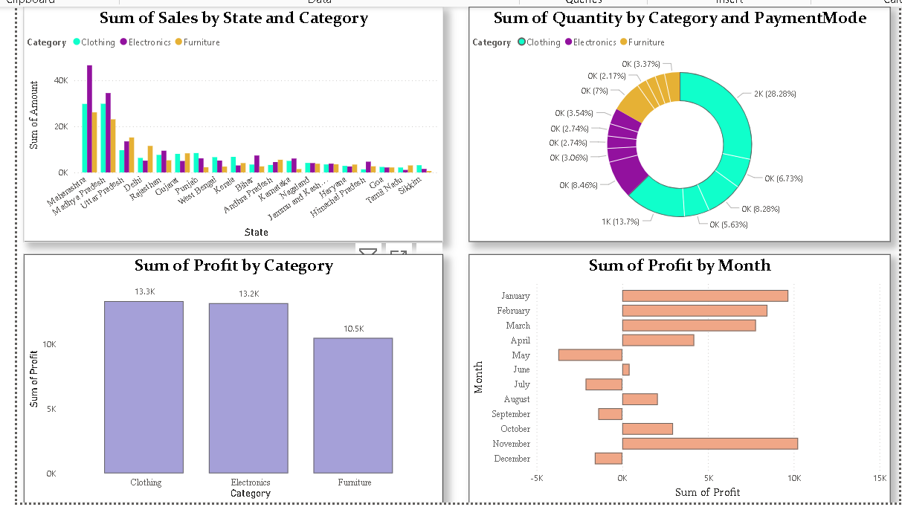
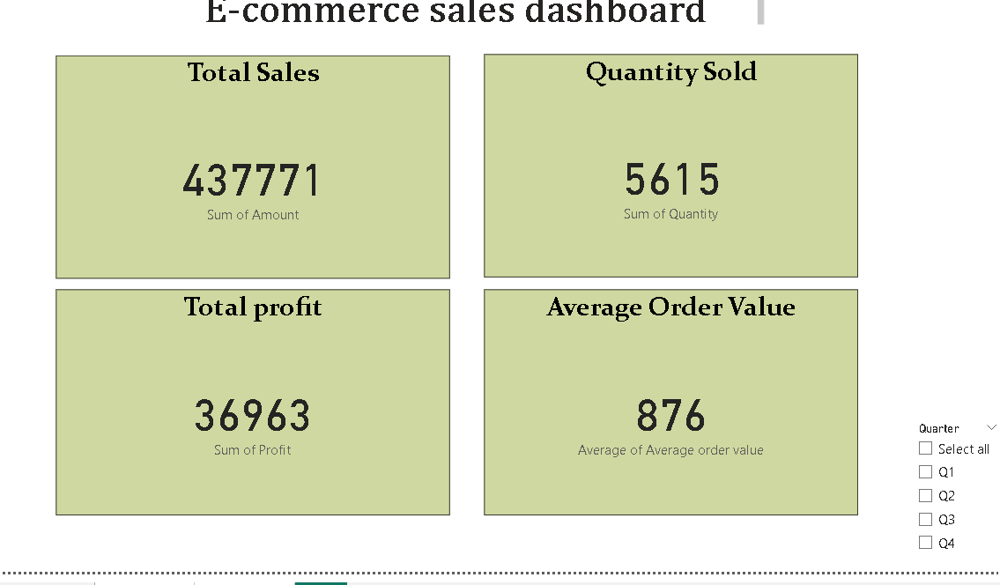
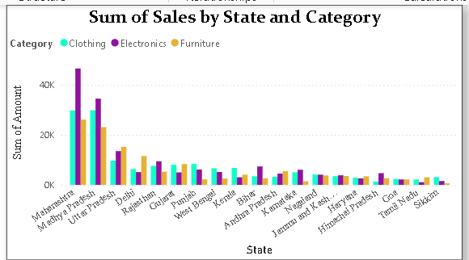
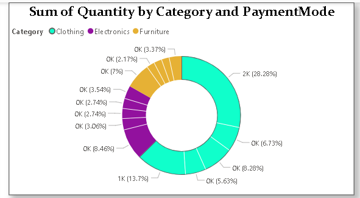
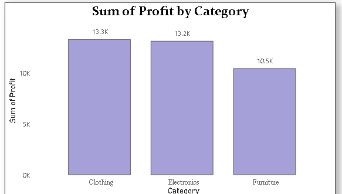
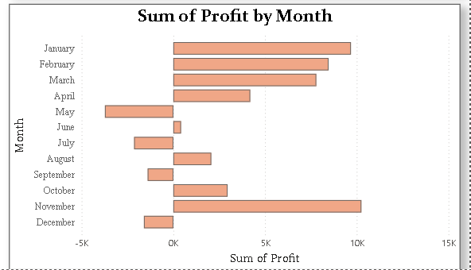

# 📊 E-Commerce Sales Dashboard using Power BI

## Project Overview

This project presents an interactive Power BI dashboard built to analyze sales, profit, and business performance using an E-Commerce dataset.

## Dataset

- E-Commerce Sales Dataset

## Tools Used

- Power BI
- Power Query
- DAX

## Dashboard Features

- KPI Cards for Total Sales, Quantity, Profit and Average Order Value
- Category-wise Sales Analysis
- State-wise Sales Analysis
- Customer-wise Analysis
- Profit Analysis
- Interactive Filters and Slicers

## Key Insights

- Maharashtra recorded the highest sales.
- Clothing category generated the highest quantity sold.
- Clothing category generated the highest profit.
- The dashboard provides insights to support data-driven decision-making.

## Files

- E-Commerce Sales Dashboard.pbix

## Author

*Gopika J*

## 📷 Dashboard Screenshots

### 1. Dashboard Overview

---

### 2. KPI Cards

---

### 3. Sales by State Analysis

---

### 4. Category Analysis

---

### 5. Profit by Category

---

### 6. Monthly Profit Trend

